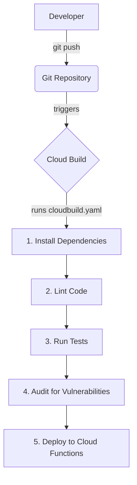
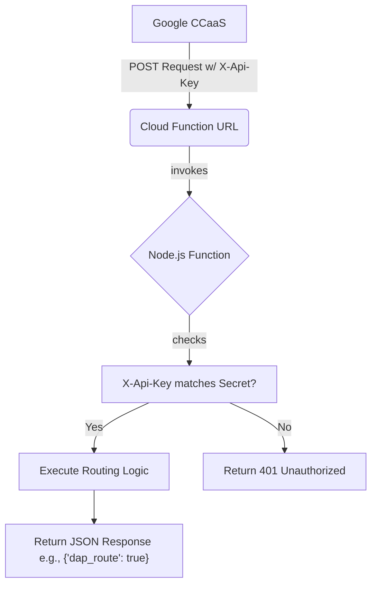

# Overview

The **Google CCaaS** (formerly known as CCAI Platform) provides the **Direct Access Point (DAP) API**, which enterprises implement and host. This **API Response Direct Access Point (API DAP)** allows for the evaluation of multiple conditions, both within and outside your CRM or enterprise back-office infrastructure, to intelligently route sessions. When an end-user calls in, their contact data is compared against the API data. Based on these comparisons, the contact is then routed to a specific point within the Interactive Voice Response (IVR) system.

You can find the full documentation for the DAP API here: [https://cloud.google.com/contact-center/ccai-platform/docs/dap](https://cloud.google.com/contact-center/ccai-platform/docs/dap)

This implementation provides an example webhook for use with the Google CCaaS Direct Access Point (DAP) API. It's built as a **Node.js application** running as a **2nd Generation Google Cloud Function**.

The primary goal of this webhook is to receive secure API calls from the Google CCaaS and return a **JSON payload** that dynamically controls call routing.

-----

## Key Features

  * **Serverless & Scalable**: Runs as a Google Cloud Function, automatically scaling from zero to handle any load. This ensures high availability and cost-efficiency.
  * **Automated CI/CD Pipeline**: Integrates with Google Cloud Build for a complete Continuous Integration/Continuous Deployment pipeline. Every `git push` to the `main` branch automatically lints, tests, scans, and deploys the function.
  * **Secure by Design**:
      * Uses a **secret API key** for authenticating requests from the Google CCaaS.
      * API keys are securely managed using **Google Secret Manager**.
      * The deployment pipeline is governed by a dedicated, least-privilege **IAM Service Account**.
  * **Developer-Friendly**: Includes scripts for local development, testing, and code linting to ensure code quality and consistency.
  * **Portable & Future-Proof**: The build configuration is decoupled from the source repository, making it easy to use with any Git provider (e.g., Google Source, GitHub, GitLab, Bitbucket) without changing the build logic.

-----

## How It Works

There are two main processes: the one-time CI/CD deployment flow and the runtime request flow.

### CI/CD Deployment Flow



### Runtime Request Flow



-----

## Project Structure

```
.
├── cloudbuild.yaml   # CI/CD pipeline definition for Google Cloud Build.
├── index.mjs         # The main Cloud Function source code.
├── index.test.mjs    # Automated tests for the function.
├── package-lock.json # Records exact versions of dependencies.
├── package.json      # Project metadata, scripts, and dependencies.
├── LICENSE           # Apache License 2.0 file.
├── CONTRIBUTING.md   # Contributing instructions.
└── README.md         # This readme file.
```

-----

## Prerequisites

Before setting up, ensure you have:

  * A **Google Cloud Project**.
  * The **gcloud command-line tool** installed and authenticated (`gcloud auth login`).
  * **Node.js** and **npm** installed on your local machine.
  * A **Git repository** (like the one you mentioned: `https://ccaas-incubation-internal.googlesource.com/ccaas-DAP-API`) containing the project files.
  * The following **IAM roles** for your user account or the account running the setup commands:
      * `Project IAM Admin` (or roles sufficient to create service accounts and grant permissions)
      * `Secret Manager Admin`
      * `Cloud Build Editor`
      * `Service Account User`

-----

## First-Time Setup and Deployment

These steps only need to be performed once for a new environment.

### Step 1: Create the Service Account

This service account will be used by the Cloud Function to access secrets.

```bash
# Define your variables
export PROJECT_ID="your-gcp-project-id"
export SERVICE_ACCOUNT_NAME="ccaip-dap-func-sa"
export SERVICE_ACCOUNT_EMAIL="${SERVICE_ACCOUNT_NAME}@${PROJECT_ID}.iam.gserviceaccount.com"

# Set your project context
gcloud config set project $PROJECT_ID

# Create the service account
gcloud iam service-accounts create $SERVICE_ACCOUNT_NAME \
  --display-name="Google CCaaS DAP Function Service Account"

# Grant the service account permission to access secrets
gcloud projects add-iam-policy-binding $PROJECT_ID \
  --member="serviceAccount:${SERVICE_ACCOUNT_EMAIL}" \
  --role="roles/secretmanager.secretAccessor"

# Grant Cloud Build permission to act as this service account during deployment
PROJECT_NUMBER=$(gcloud projects describe $PROJECT_ID --format='value(projectNumber)')
gcloud projects add-iam-policy-binding $PROJECT_ID \
  --member="serviceAccount:${PROJECT_NUMBER}@cloudbuild.gserviceaccount.com" \
  --role="roles/iam.serviceAccountUser"
```

### Step 2: Create the API Key in Secret Manager

```bash
# Create the secret container
gcloud secrets create DAP_API_KEY \
  --replication-policy="automatic"

# Add the first version of your secret value.
# Replace "your-very-secret-api-key" with a securely generated key.
printf "your-very-secret-api-key" | gcloud secrets versions add DAP_API_KEY --data-file=-
```

### Step 3: Configure and Enable the Cloud Build Trigger

1.  Navigate to the **Cloud Build Triggers** page in the Google Cloud Console.
2.  Connect your repository source (e.g., GitHub, Bitbucket, GitLab, or an external Git repository via a connection).
3.  Click **Create trigger**.
4.  **Name**: `deploy-ccaip-dap-webhook`
5.  **Event**: `Push to a branch`
6.  **Source Repository**: Select your connected Git repository.
7.  **Branch Name**: `^main$` (or your primary branch).
8.  **Configuration**: Select `Cloud Build configuration file (yaml or json)`. The default location (`/cloudbuild.yaml`) is correct.
9.  **Advanced \> Substitution variables**:
      * `_SERVICE_ACCOUNT`: `ccaip-dap-func-sa` (or the name you chose in Step 1).
      * `_PROJECT_ID`: Your Google Cloud Project ID.
10. Click **Create**.

### Step 4: Deploy

The setup is complete. The pipeline will now run automatically on every push to the `main` branch. To trigger the first deployment, simply commit and push a change:

```bash
git commit --allow-empty -m "chore: Initial deployment trigger"
git push
```

You can monitor the build progress in the Cloud Build history. Once it succeeds, your function will be deployed and ready to use.

-----

## Configuration

### Runtime Configuration

The function's behavior is configured with environment variables.

| Variable  | Description                                      | Default |
| :-------- | :----------------------------------------------- | :------ |
| `API_KEY` | (Required) The secret API key for validation.    | `''`    |
| `DEBUG`   | If `true`, enables verbose logging of headers/body. | `false` |

**Note**: `API_KEY` is set securely via the `--set-secrets` flag in the `cloudbuild.yaml` and should not be set manually.

### Build Configuration

The `cloudbuild.yaml` uses substitution variables for flexibility. These are set in the Cloud Build Trigger.

| Variable          | Description                                    | Default       |
| :---------------- | :--------------------------------------------- | :------------ |
| `_PROJECT_ID`     | (Required) Your Google Cloud project ID.       | (none)        |
| `_SERVICE_ACCOUNT`| (Required) The name of the function's service account. | (none)        |
| `_REGION`         | The Google Cloud region to deploy the function to. | `us-central1` |
| `_MEMORY`         | The memory allocated to the function.          | `512mb`       |
| `_MIN_INSTANCES`  | The minimum number of warm instances for the function. | `0`           |
| `_DEBUG`          | Sets the DEBUG environment variable in the function. | `false`       |

-----

## Google CCaaS Setup

To set up the Google CCaaS, follow these steps:

1.  Log in to Google CCaaS as an administrator.
2.  Navigate to **Settings -\> Developer Settings**.
3.  Go to the **API Request Direct Access Point** section.
4.  Enter the **Post Request URL**. This is the URL of the Cloud Function that you noted previously.
5.  For **Authentication Method**:
      * Select `Custom Header`.
      * Select `Add Field`.
      * Enter the field key of: `X-Api-Key`.
      * Enter the field value of the secret value you set previously.
      * Select `Save`.
6.  To test the connection:
      * Enter a phone number.
      * Select `Test This Connection`.

-----

## Direct Access Points (DAPs)

**Purpose**: Route calls directly to specific queues based on various criteria (user segments, phone numbers, API responses).

**Types**: User Segment DAP, General DAP, Support Phone Number DAP, API Response DAP, Mobile App DAP.

### DAP Configuration

1.  **Choose Queue**: **Settings \> Queue \> {Channel} \> Edit/Add \> Select Queue**.
2.  **Create DAP**: **Access Point \> + Create direct access point**.
3.  **Configure**: Enter details based on the DAP type.
4.  **Test**: Make a test call to verify routing.

-----

## Other Routing Features

  * **Twinning**: Allows agents to forward calls to their mobile phones.
  * **Percent Allocation Groups**: Distribute call/chat percentages among agent groups.
  * **Queue Priority**: Prioritize specific queues for faster routing.
  * **Automatic Redirection**: Route users based on predefined workflows.
  * **Auto-Answer**: Automatically connect calls/chats to agents.